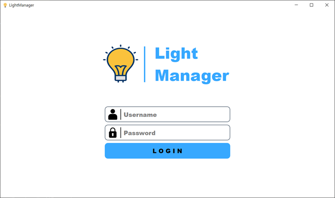
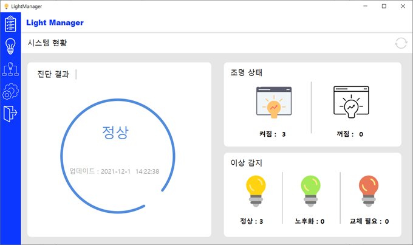
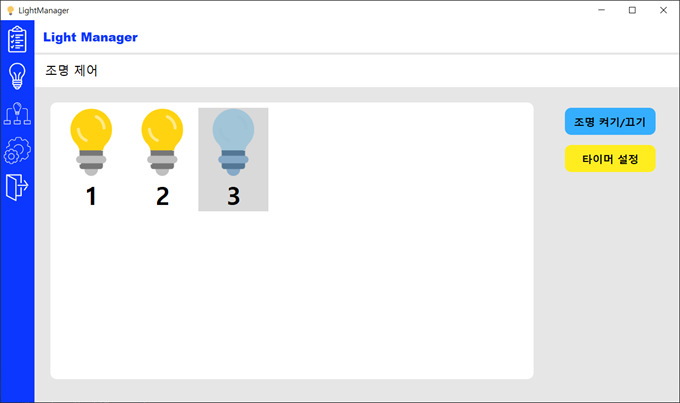
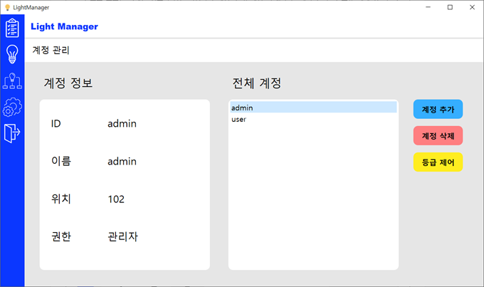

# Light Manager
>2021년 2학기 소프트웨어공학 Team Project : *조명 관리 시스템*  - 클라이언트
 

##  프로젝트 소개
시스템에 등록된 전체 조명을 관리하는 프로그램입니다. 개별 조명의 제어가 가능하고 전체 조명의 정보 및 상태 확인, 이상상태 감지
및 통합 시스템 정보를 제공합니다.

##  Screenshot

## Techs
   ### [PyQT5](https://pypi.org/project/PyQt5/)
    - 핵심 UI 구현 프레임워크로 PyQT5를 사용하였습니다.
